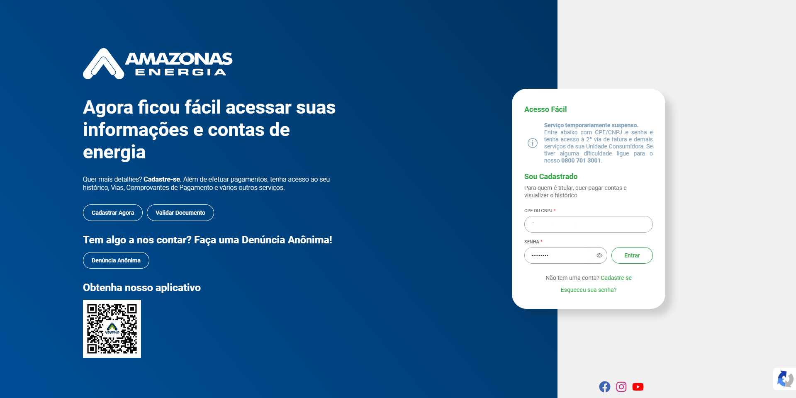

# automEnergia

Projeto de Automação de Coleta de Contas de Energia com Scraper

Você já se cansou de perder tempo baixando manualmente suas contas de energia elétrica de diferentes empresas? Se sim, este projeto é a solução que você estava procurando! Apresentamos o AutomEnergia, um conjunto de ferramentas de automação de coleta de contas de energia que elimina a dor de ter que acessar e baixar repetidamente suas faturas de energia de várias empresas.





## Instalação

Para executar este projeto, você precisará das bibliotecas Python `requests` e `pandas`. Você pode instalá-las usando o seguinte comando:

```bash
pip install requests pandas
```

## Executar

Para executar este projeto  usando o seguinte comando:

```bash
python main.py
```


#scrapy #python #pandas #csv #amazonas #energia